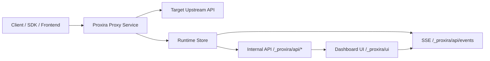

<p align="center">
  
</p>

<h1 align="center">Proxira</h1>

<p align="center">
  轻量化实时请求代理工具：本地转发 + 可视化观测面板
</p>

<p align="center">
  <a href="https://www.npmjs.com/package/proxira"></a>
  
  
  
</p>

Proxira 是一个面向本地开发联调的代理与观测工具。你可以把前端、SDK、脚本请求统一指向本地代理入口，再通过 Web 管理面板实时查看请求/响应、耗时、错误、分组配置等信息。

> [!IMPORTANT]
> Proxira 的定位是本地开发调试工具，不建议直接暴露在公网环境。

## 核心能力

- 透明代理转发：保留 Method / Path / Query / Headers / Body。
- 实时观测：SSE 推送请求事件，面板实时更新。
- 多分组管理：每个分组独立上游地址与历史记录。
- 便捷排查：支持状态筛选、方法筛选、耗时排序、时间排序。
- 数据导出：历史记录支持导出 JSON。
- 详情复制：一键复制 URL、Headers、Body、cURL。
- HTTPS 本地调试：支持一键生成自签名证书并启用 HTTPS。
- 多格式展示：JSON / XML / YAML / HTML / CSV / Markdown / Text。

> [!NOTE]
> 当前版本代理记录对请求/响应正文按“全量记录”策略处理，不再按 `PROXY_BODY_LIMIT` 截断。

## 架构概览



- `apps/getway`：Node.js 代理服务 + CLI（npm 包主体）。
- `apps/dashboard`：Vue 3 + Vite 管理面板。
- `packages/core`：前后端共享类型定义。

## 仓库结构

```text
proxira/
├─ apps/
│  ├─ getway/       # 代理服务、CLI、内部 API、SSE、打包入口
│  └─ dashboard/    # Vue 管理面板
├─ packages/
│  └─ core/         # 共享 types
├─ package.json     # Monorepo 根脚本
└─ pnpm-workspace.yaml
```

## 快速开始

### npm 仓库说明

- npm 包名：`proxira`
- npm 地址：`https://www.npmjs.com/package/proxira`
- 可执行命令：`proxira`
- 发布来源：`apps/getway`（仓库根目录是 monorepo 管理脚本，`private: true`，不会发布到 npm）

推荐使用方式：

```bash
# 临时使用最新版（推荐）
npx proxira@latest

# 固定版本使用（便于团队复现）
npx proxira@0.1.3

# 全局安装
npm i -g proxira
```

包内主要包含：

- `dist/`：CLI 与代理服务可执行代码
- `dashboard-dist/`：管理面板静态资源
- `README.md`：npm 展示文档

### 方式一：直接使用 npx（推荐）

```bash
npx proxira
```

默认访问地址：

- 代理入口：`http://localhost:3000/proxira`
- 管理面板：`http://localhost:3000/_proxira/ui`
- 健康检查：`http://localhost:3000/_proxira/api/health`

### 方式二：本地仓库开发

```bash
# 1) 安装依赖
pnpm install

# 2) 构建应用（dashboard + getway）
pnpm run build:app

# 3) 启动代理服务
pnpm run start:app
```

## 常见使用方式

### 指定端口和上游

```bash
npx proxira --port 3010 --target http://localhost:8080
```

### 自定义代理前缀

```bash
npx proxira --prefix /debug-proxy --target http://localhost:8080
```

### 关闭前缀（直转发）

```bash
npx proxira --no-prefix --target http://localhost:8080
```

> [!TIP]
> 关闭前缀后，`/_proxira/*` 仍保留给管理面板与内部 API，其余路径会转发到上游。

## HTTPS 调试模式

```bash
# 1) 生成本地证书（带环境检测）
npx proxira gen-cert

# 2) 启动 HTTPS
npx proxira --https
```

手动指定证书：

```bash
npx proxira --https --https-key ./.proxira/certs/key.pem --https-cert ./.proxira/certs/cert.pem
```

## CLI 命令

```bash
proxira [options]
proxira clear-cache [options]
proxira gen-cert [options]
```

常用参数：

| 参数 | 说明 | 默认值 |
| --- | --- | --- |
| `-p, --port <port>` | 服务端口 | `3000` |
| `-t, --target <url>` | 上游服务地址 | `http://localhost:8080` |
| `-d, --data-dir <path>` | 数据目录 | `./.proxira` |
| `-x, --prefix <path>` | 自定义代理前缀 | `/proxira` |
| `-nx, --no-prefix` | 关闭代理前缀 | - |
| `-s, --https` | 启用 HTTPS | - |
| `--https-key <path>` | HTTPS 私钥路径 | - |
| `--https-cert <path>` | HTTPS 证书路径 | - |
| `-b, --no-banner` | 关闭启动 Banner | - |
| `-h, --help` | 帮助信息 | - |
| `-v, --version` | 版本信息 | - |

`gen-cert` 参数：

| 参数 | 说明 | 默认值 |
| --- | --- | --- |
| `-o, --output-dir <path>` | 证书输出目录 | `./.proxira/certs` |
| `-c, --common-name <name>` | 证书通用名 | `localhost` |
| `--days <number>` | 证书有效期（天） | `365` |
| `-y, --yes` | 跳过确认直接生成 | - |

## 开发命令（Monorepo）

```bash
# 后端 watch
pnpm run dev:getway

# 前端 dev server
pnpm run dev:dashboard

# 构建全部
pnpm run build

# 构建可发布应用（含 dashboard-dist）
pnpm run build:app

# 打包 CLI（tgz）
pnpm run pack:cli
```

## 环境变量

| 变量 | 说明 | 默认值 |
| --- | --- | --- |
| `PORT` | 服务端口 | `3000` |
| `PROXY_TARGET_URL` | 默认上游地址 | `http://localhost:8080` |
| `PROXY_DATA_DIR` | 本地数据目录 | `./.proxira` |
| `PROXY_PREFIX` | 代理前缀 | `/proxira` |
| `PROXY_PREFIX_ENABLED` | 是否启用代理前缀 | 启用 |
| `PROXY_BODY_LIMIT` | 兼容保留（当前版本不生效） | - |
| `PROXY_HISTORY_LIMIT` | 内存历史上限 | `1000` |
| `PROXY_HISTORY_PERSIST_LIMIT` | 落盘历史上限 | `200` |
| `PROXY_QUERY_LIMIT_MAX` | 查询接口最大 limit | `500` |
| `PROXY_SSE_HEARTBEAT_MS` | SSE 心跳间隔（毫秒） | `15000` |
| `PROXY_DISABLE_BANNER` | 是否关闭启动 Banner | 关闭为 `1` |
| `PROXY_HTTPS_ENABLED` | 是否启用 HTTPS | 关闭 |
| `PROXY_HTTPS_KEY_PATH` | HTTPS 私钥路径 | - |
| `PROXY_HTTPS_CERT_PATH` | HTTPS 证书路径 | - |

## 管理接口（概览）

| 方法 | 路径 | 说明 |
| --- | --- | --- |
| `GET` | `/_proxira/api/health` | 健康检查 |
| `GET` | `/_proxira/api/status` | 服务状态 |
| `GET` | `/_proxira/api/config` | 读取当前配置 |
| `PUT` | `/_proxira/api/config` | 切换激活分组 |
| `POST` | `/_proxira/api/groups` | 创建分组 |
| `PUT` | `/_proxira/api/groups/:id` | 更新分组 |
| `DELETE` | `/_proxira/api/groups/:id` | 删除分组 |
| `GET` | `/_proxira/api/records` | 查询历史 |
| `GET` | `/_proxira/api/records/export` | 导出记录 |
| `DELETE` | `/_proxira/api/records/:id` | 删除单条 |
| `DELETE` | `/_proxira/api/records` | 清空分组历史 |
| `GET` | `/_proxira/api/events` | SSE 事件流 |
| `POST` | `/_proxira/api/reset` | 重置数据 |

## 测试

```bash
# getway 单元/集成测试
pnpm --filter ./apps/getway test

# dashboard 构建校验
pnpm --filter @proxira/dashboard build
```

> [!WARNING]
> 默认会记录请求与响应正文，请在真实数据联调时注意敏感信息处理。
