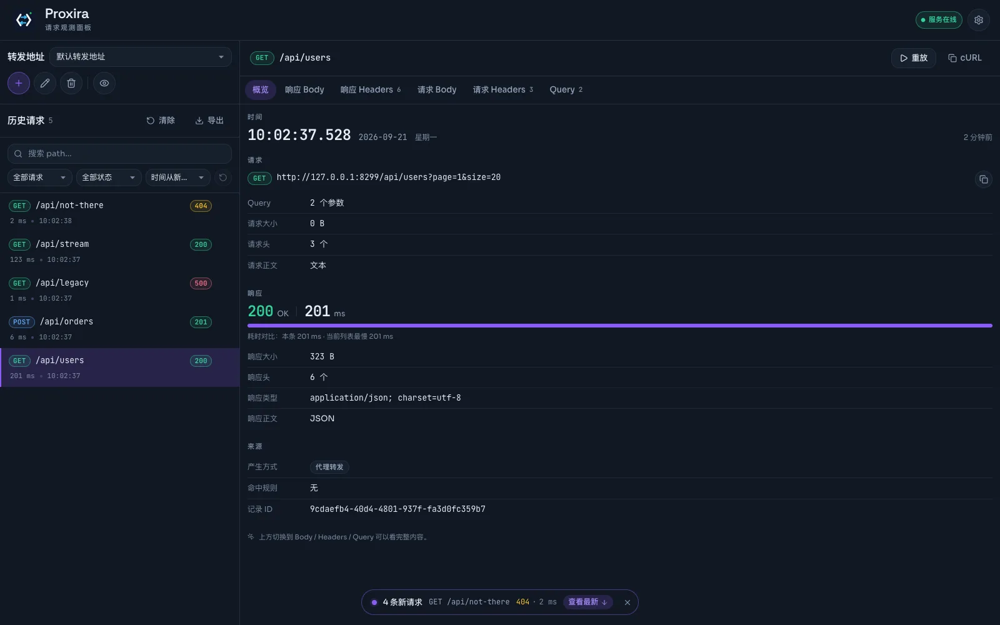
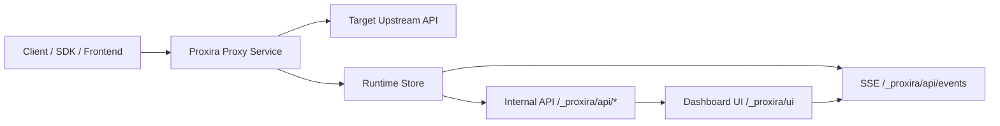

<p align="center">
  
</p>

<h1 align="center">Proxira</h1>

<p align="center">
  轻量化实时请求代理工具：本地转发 + 可视化实时观测面板
</p>

<p align="center">
  <a href="https://www.npmjs.com/package/proxira"></a>
  
  
  
</p>

<h3 align="center">
  <a href="https://proxira.oceandeep.top/">→ 打开官网 · 完整用法文档</a>
</h3>

<p align="center">
  <a href="https://proxira.oceandeep.top/guide/">用法</a> ·
  <a href="https://proxira.oceandeep.top/changelog/">更新日志</a> ·
  <a href="https://www.npmjs.com/package/proxira">npm</a> ·
  <a href="https://github.com/oceanDeep512/proxira/issues">问题反馈</a>
</p>



把前端 / SDK / 脚本的请求统一指向本地代理入口，Proxira 原样转发到真实上游，
并在 Web 面板里实时展示每一条请求与响应。

**产品文档全部在官网**（参数表、环境变量、面板用法、Mock 拦截、故障注入、请求头分组、
请求重放、HTTPS 调试、局域网共享、内部管理接口……）。本文件只保留「怎么跑起来」和「怎么改这个仓库」。

> [!IMPORTANT]
> 定位是本地开发调试工具：面板能看完整正文、也能改上游地址，请勿直接暴露公网。

## 核心能力

- **透明转发**：Method / Path / Query / Headers / Body 原样送达，默认不改任何东西。
- **实时观测**：SSE 推送，面板实时更新；支持状态 / 方法筛选与耗时、时间排序。
- **请求详情**：按「时间 → 请求 → 响应 → 来源」铺开，JSON 树带行号、可折叠，SSE 按帧展示。
- **多转发地址**：每个地址独立的上游与历史记录，随时切换激活地址。
- **Mock 拦截 / 故障注入**：命中即返回不打上游；或模拟错误、延迟、流式中断、响应截断。
- **请求头分组**：固定头 + 前缀改写规则打包复用，按分组顺序叠加、后者覆盖前者。
- **请求重放与差异对比**：改完参数直接重发上游，并与原响应逐行对比。
- **脱敏与导出**：`authorization` / `cookie` / `api_key` 默认打码；历史可导出 JSON。

## 快速开始

```bash
npx proxira            # 直接跑，不安装（推荐）
npx proxira@0.4.0      # 固定版本
npm i -g proxira       # 全局安装
```

启动后代理入口是 `http://localhost:3000/proxira`，面板在 `http://localhost:3000/_proxira/ui`。

接入通常只改 baseURL：把 `https://api.example.com/v1/users` 换成
`http://localhost:3000/proxira/v1/users` 即可。

> [!NOTE]
> 默认只监听 `127.0.0.1`，其他电脑连不上；需要局域网访问用 `proxira --host`（不带值即可）。
> 全部参数见官网的 [CLI 参数](https://proxira.oceandeep.top/guide/#cli-参数) 与
> [环境变量](https://proxira.oceandeep.top/guide/#环境变量)。

## 仓库结构

```text
proxira/
├─ apps/
│  ├─ getway/       # 代理服务、CLI、内部 API、SSE（npm 包主体）
│  ├─ dashboard/    # React 19 + Vite + Tailwind v4 管理面板
│  └─ web/          # 官网（Astro，独立依赖，已排除出 pnpm workspace）
├─ packages/
│  └─ core/         # 前后端共享 types
├─ scripts/         # 发版辅助（更新日志草稿 / 校验）
├─ package.json     # Monorepo 根脚本
└─ pnpm-workspace.yaml
```


```mermaid
flowchart LR
  Client[Client / SDK / Frontend] --> Proxy[Proxira Proxy Service]
  Proxy --> Upstream[Target Upstream API]
  Proxy --> Runtime[Runtime Store]
  Runtime --> SSE[SSE /_proxira/api/events]
  Runtime --> API[Internal API /_proxira/api/*]
  API --> Dashboard[Dashboard UI /_proxira/ui]
  Dashboard --> SSE
```

## 开发命令（Monorepo）

所有命令都在**仓库根目录**执行。

| 命令 | 作用 |
| --- | --- |
| `pnpm dev` | 一键启动：后端 watch（:3000）+ 面板 dev server（:5173），并行运行 |
| `pnpm dev:server` / `pnpm dev:web` | 只起后端 / 只起面板 |
| `pnpm build` | 构建可发布产物（dashboard → 同步进 getway → tsc） |
| `pnpm start` | `build` + 启动后端（等价于跑发布包） |
| `pnpm serve` | 只启动后端（用已有 `dist`） |
| `pnpm test` | 后端 vitest 全量测试 |

> [!TIP]
> **dev 模式请用环境变量调参，CLI 参数无效**：`pnpm dev` 跑的是 `src/index.ts`，
> 而 `-p` / `-t` / `--host` 只在 `cli.ts` 里解析（它的工作就是转成环境变量再启动服务）。
>
> ```bash
> PORT=4000 pnpm dev
> ```

> [!WARNING]
> 不要直接敲 `pnpm pack` / `pnpm publish` —— 它们是 **pnpm 内置命令**，作用于根目录自身
> （根包 `private: true`），不会带上 `run`。发布一律走 `pnpm run pack:app` / `pnpm run publish:npm`。

## 发布到 npm

```bash
pnpm test                  # 后端测试
pnpm run pack:app          # 本地验证产物：生成 proxira-<version>.tgz，可装到干净目录试跑
pnpm run publish:npm       # 发布（prepublishOnly 会自动构建）
```

> [!TIP]
> 发布走 `pnpm publish`（**不是** `npm publish`）：`@proxira/core` 用 `workspace:*` 协议，
> 只有 pnpm 会把它改写成真实版本号。

### 更新日志怎么同步到官网

**更新日志只有一份，就在官网**：`apps/web/src/data/changelog.ts`。仓库里不再维护
`CHANGELOG.md`，避免两处各写一遍、然后慢慢漂移。发版按下面五步走：

```bash
# 1) 升版本号（只改 package.json，不打 tag）
pnpm run bump:minor        # 或 bump:patch / bump:major

# 2) 从本次提交生成草稿条目，自动插到 changelog.ts 顶部
pnpm run changelog:draft

# 3) 手改文案：摘要一句话 + 各条改成用户能读懂的话，删掉 chore/docs 这类内部改动
#    （脚本会提示有几条不像用户可见的改动）

# 4) 校验 + 提交推送。官网接的是这个仓库，push 后会自动重建
pnpm run check:changelog
git add -A && git commit -m "chore: release proxira v0.5.0" && git push

# 5) 发布到 npm
pnpm run publish:npm
```

为什么要有 `check:changelog`：它挂在 `publish:npm` 前面，更新日志里没有当前版本的条目就**发不出去**。
否则「忘了写更新日志」这种失误只有用户翻官网时才会发现。

为什么草稿还要手改一遍：提交信息是写给开发者的（含 `refactor:` / `docs:` 这类内部改动），
更新日志是写给用户的。脚本保证**不漏**，文案由人保证**能读懂**。

## 能力边界

- **不支持 WebSocket 及其他 HTTP Upgrade 协议**：握手请求返回 `501`，不静默降级。调试 WebSocket 请直连上游。
- **不做系统代理接管**：只监听自己的端口，需要你手动把请求地址指过去。
- **不解密 HTTPS 上游**：`--https` 只让「客户端 → 代理」这一段走 HTTPS（自签名证书）。
- 其余细节（正文截断阈值、流式捕获、超时语义等）见官网的
  [能力边界](https://proxira.oceandeep.top/guide/#能力边界)。

## License

MIT
