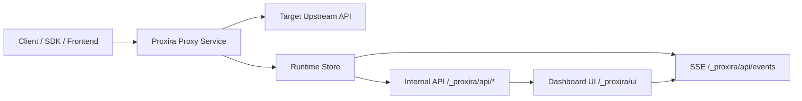

<p align="center">
  
</p>

<h1 align="center">Proxira</h1>

<p align="center">
  轻量化实时请求代理工具：本地转发 + 可视化观测面板
</p>

<p align="center">
  <a href="https://www.npmjs.com/package/proxira"></a>
  
  
  
</p>

Proxira 是一个面向本地开发联调的代理与观测工具。你可以把前端、SDK、脚本请求统一指向本地代理入口，再通过 Web 管理面板实时查看请求/响应、耗时、错误、分组配置等信息。

> [!IMPORTANT]
> Proxira 的定位是本地开发调试工具，不建议直接暴露在公网环境。

## 核心能力

- 透明代理转发：保留 Method / Path / Query / Headers / Body。
- 实时观测：SSE 推送请求事件，面板实时更新。
- 多分组管理：每个分组独立上游地址与历史记录。
- 便捷排查：支持状态筛选、方法筛选、耗时排序、时间排序。
- 数据导出：历史记录支持导出 JSON。
- 详情复制：一键复制 URL、Headers、Body、cURL。
- HTTPS 本地调试：支持一键生成自签名证书并启用 HTTPS。
- 多格式展示：JSON / XML / YAML / HTML / CSV / Markdown / Text。
- 拦截规则：按路径/方法匹配后执行 Mock、模拟错误、延迟、流式中断、响应截断。
- 请求重放：改完参数直接重发上游，并与原响应做逐行差异对比。
- 敏感信息脱敏：`authorization` / `cookie` / `api_key` 等默认打码，一键切换原文。
- 可选访问令牌：`--token` 保护内部 API 与 SSE（面板静态资源不受影响）。
- 统一数据目录：历史与配置存放在用户级目录，与启动端口 / 启动方式 / 工作目录无关，并提供旧数据迁移命令。

> [!NOTE]
> 代理默认记录完整的请求/响应正文；仅当单个正文超过 `PROXY_MAX_BODY_CAPTURE_BYTES`（默认 2MB）时，记录会截断为前缀并标记 `truncated`，转发给客户端的响应始终完整。
>
> 服务默认只监听 `127.0.0.1`，局域网/容器外访问需显式指定 `--host 0.0.0.0`。
>
> 流式响应（SSE 等）不会为了观测而完整缓冲，否则会拖住请求；面板按采样增量显示已收到的内容。

## 架构概览


```mermaid
flowchart LR
  Client[Client / SDK / Frontend] --> Proxy[Proxira Proxy Service]
  Proxy --> Upstream[Target Upstream API]
  Proxy --> Runtime[Runtime Store]
  Runtime --> SSE[SSE /_proxira/api/events]
  Runtime --> API[Internal API /_proxira/api/*]
  API --> Dashboard[Dashboard UI /_proxira/ui]
  Dashboard --> SSE
```

- `apps/getway`：Node.js 代理服务 + CLI（npm 包主体）。
- `apps/dashboard`：Vue 3 + Vite 管理面板。
- `packages/core`：前后端共享类型定义。

## 仓库结构

```text
proxira/
├─ apps/
│  ├─ getway/       # 代理服务、CLI、内部 API、SSE、打包入口
│  └─ dashboard/    # Vue 管理面板
├─ packages/
│  └─ core/         # 共享 types
├─ package.json     # Monorepo 根脚本
└─ pnpm-workspace.yaml
```

## 快速开始

### TL;DR

```bash
npx proxira                 # 直接用（无需安装）
pnpm dev                    # 本地开发：一行启动后端 + 面板
pnpm start                  # 构建并启动（等价于跑发布产物）
pnpm run release            # 发版并发布到 npm（注意要带 run）
```

### npm 仓库说明

- npm 包名：`proxira`
- npm 地址：`https://www.npmjs.com/package/proxira`
- 可执行命令：`proxira`
- 发布来源：`apps/getway`（仓库根目录是 monorepo 管理脚本，`private: true`，不会发布到 npm）

推荐使用方式：

```bash
# 临时使用最新版（推荐）
npx proxira@latest

# 固定版本使用（便于团队复现）
npx proxira@0.1.8

# 全局安装
npm i -g proxira
```

包内主要包含：

- `dist/`：CLI 与代理服务可执行代码
- `dashboard-dist/`：管理面板静态资源
- `README.md`：npm 展示文档

### 方式一：直接使用 npx（推荐）

```bash
npx proxira
```

默认访问地址：

- 代理入口：`http://localhost:3000/proxira`
- 管理面板：`http://localhost:3000/_proxira/ui`
- 健康检查：`http://localhost:3000/_proxira/api/health`

### 方式二：本地仓库开发

```bash
# 1) 安装依赖
pnpm install

# 2) 一键启动（后端代理 :3000 + 面板 dev server :5173，并行热更新）
pnpm dev

# 或只想跑构建产物：构建 + 启动（只有 :3000）
pnpm start
```

- 后端代理：`http://127.0.0.1:3000`
- 面板热更新：`http://127.0.0.1:5173`（已配置代理，可直接调 `/_proxira/api/*`）
- 完整命令见 [开发命令](#开发命令monorepo)。

## 常见使用方式

### 指定端口和上游

```bash
npx proxira --port 3010 --target http://localhost:8080
```

### 自定义代理前缀

```bash
npx proxira --prefix /debug-proxy --target http://localhost:8080
```

### 关闭前缀（直转发）

```bash
npx proxira --no-prefix --target http://localhost:8080
```

> [!TIP]
> 关闭前缀后，`/_proxira/*` 仍保留给管理面板与内部 API，其余路径会转发到上游。

### 分组级超时

在面板「编辑当前分组」里可以单独设置上游超时（毫秒），留空则回落到全局的
`PROXY_UPSTREAM_TIMEOUT_MS`（默认 30s）。适合某个上游特别慢、又不想把全局超时调大的场景，
超时后该分组的请求返回 504。

## HTTPS 调试模式

```bash
# 1) 生成本地证书（带环境检测）
npx proxira gen-cert

# 2) 启动 HTTPS
npx proxira --https
```

手动指定证书（默认位于 `<数据目录>/certs/`）：

```bash
npx proxira --https --https-key ./my-certs/key.pem --https-cert ./my-certs/cert.pem
```

## CLI 命令

```bash
proxira [options]
proxira clear-cache [options]
proxira gen-cert [options]
```

常用参数：

| 参数 | 说明 | 默认值 |
| --- | --- | --- |
| `-p, --port <port>` | 服务端口 | `3000` |
| `-t, --target <url>` | 上游服务地址 | `http://localhost:8080` |
| `-d, --data-dir <path>` | 数据目录 | `./.proxira` |
| `--host <address>` | 监听地址 | `127.0.0.1` |
| `-x, --prefix <path>` | 自定义代理前缀 | `/proxira` |
| `-nx, --no-prefix` | 关闭代理前缀 | - |
| `-s, --https` | 启用 HTTPS | - |
| `--https-key <path>` | HTTPS 私钥路径 | - |
| `--https-cert <path>` | HTTPS 证书路径 | - |
| `-b, --no-banner` | 关闭启动 Banner | - |
| `--token <token>` | 为内部 API / SSE 设置访问令牌 | 关闭 |
| `-h, --help` | 帮助信息 | - |
| `-v, --version` | 版本信息 | - |

`gen-cert` 参数：

| 参数 | 说明 | 默认值 |
| --- | --- | --- |
| `-o, --output-dir <path>` | 证书输出目录 | `<数据目录>/certs` |
| `-c, --common-name <name>` | 证书通用名 | `localhost` |
| `--days <number>` | 证书有效期（天） | `365` |
| `-y, --yes` | 跳过确认直接生成 | - |

## 数据目录

数据目录与启动端口、启动方式、工作目录**无关**，统一按以下优先级解析：

1. `--data-dir <path>` 参数（相对路径相对当前目录解析）
2. `PROXY_DATA_DIR` 环境变量
3. 用户级默认目录：macOS `~/Library/Application Support/Proxira`，Linux `$XDG_DATA_HOME/Proxira`（默认 `~/.local/share/Proxira`），Windows `%APPDATA%\Proxira`

目录内存放 `config.json`（分组配置）、`history.json`（请求历史）、`rules.json`（拦截规则）、`instance.json`（运行实例锁）与 `certs/`（证书）。启动 Banner 会显示当前数据目录及其来源。

```bash
proxira data-dir                        # 查看当前数据目录及来源
proxira migrate-data                    # 把旧版工作目录下的 ./.proxira 迁移到统一目录
proxira migrate-data --from /some/.proxira  # 指定旧目录迁移
```

> 旧版本默认把数据写在启动目录下的 `./.proxira/`。升级后启动时若检测到旧目录里有历史数据会给出提示，按上面命令迁移即可，历史不会丢。

## 开发命令（Monorepo）

所有命令都在**仓库根目录**执行。

| 命令 | 作用 |
| --- | --- |
| `pnpm dev` | 一键启动：后端 watch（`tsx watch`，:3000）+ 面板 dev server（:5173），并行运行 |
| `pnpm dev:server` | 只起后端（:3000） |
| `pnpm dev:web` | 只起面板（:5173） |
| `pnpm build` | 构建可发布产物：先 build dashboard → 同步到 `apps/getway/dashboard-dist` → 再 `tsc` 后端 |
| `pnpm start` | `build` + 启动后端（等价于跑发布包） |
| `pnpm serve` | 只启动后端（用已有 `dist`，不重新构建） |
| `pnpm test` | 后端 vitest 全量测试 |
| `pnpm run pack:app` | 构建并生成 npm tarball 到仓库根目录（本地验证发布产物） |
| `pnpm run release` | patch 版本号 + 发布到 npm |
| `pnpm run release:minor` / `release:major` | minor / major 版本号 + 发布 |

> [!WARNING]
> 不要直接敲 `pnpm pack` / `pnpm publish` —— 这两个是 **pnpm 内置命令**，作用于根目录自身（本仓库根包名为
> `proxira-monorepo` 且 `private: true`），不会带上 `run`。发布一律走上面的 `pnpm run pack:app` / `pnpm run release`。

### 发布到 npm

```bash
# 1) 本地验证产物（生成 proxira-<version>.tgz，可装到干净目录试跑）
pnpm run pack:app

# 2) 登录一次即可
npm login

# 3) 发版并发布（会自动触发 prepublishOnly → build:pkg）
pnpm run release          # patch
pnpm run release:minor    # minor
```

> [!TIP]
> 发布走的是 `pnpm publish`（**不是** `npm publish`）。原因：`@proxira/core` 用的是 `workspace:*` 协议，
> 只有 pnpm 会把它改写成真实版本号；用 npm 打包会把 `workspace:*` 原样写进 manifest，用户安装时会解析失败。
>
> `prepublishOnly` 已挂了 `build:pkg`，所以不会出现「忘了构建就发出去、面板是旧版」的情况。

### 发布前自查

```bash
pnpm test                 # 后端测试
pnpm build                # 全量构建
pnpm run pack:app         # 看 tarball：只应有 dist / dashboard-dist / README.md / package.json
tar -tzf proxira-*.tgz | grep -v -E '^package/(dist|dashboard-dist)/'
```

## 环境变量

| 变量 | 说明 | 默认值 |
| --- | --- | --- |
| `PORT` | 服务端口 | `3000` |
| `PROXY_TARGET_URL` | 默认上游地址 | `http://localhost:8080` |
| `PROXY_DATA_DIR` | 本地数据目录 | `./.proxira` |
| `PROXY_PREFIX` | 代理前缀 | `/proxira` |
| `PROXY_PREFIX_ENABLED` | 是否启用代理前缀 | 启用 |
| `PROXY_HOST` | 监听地址 | `127.0.0.1` |
| `PROXY_UPSTREAM_TIMEOUT_MS` | 上游请求超时（毫秒），超时返回 504 | `30000` |
| `PROXY_MAX_BODY_CAPTURE_BYTES` | 单条正文记录上限，超出只记录前缀并标记 truncated | `2097152` |
| `PROXY_PERSIST_DEBOUNCE_MS` | 落盘防抖间隔（毫秒） | `500` |
| `PROXY_HISTORY_LIMIT` | 内存历史上限 | `1000` |
| `PROXY_HISTORY_PERSIST_LIMIT` | 落盘历史上限 | `200` |
| `PROXY_HISTORY_PERSIST_BODY_LIMIT` | 落盘时单条正文重新裁剪上限（内存仍保留完整内容） | `65536` |
| `PROXY_ACCESS_TOKEN` | 内部 API / SSE 的访问令牌，未设置则不做校验 | - |
| `PROXY_QUERY_LIMIT_MAX` | 查询接口最大 limit | `500` |
| `PROXY_SSE_HEARTBEAT_MS` | SSE 心跳间隔（毫秒） | `15000` |
| `PROXY_DISABLE_BANNER` | 是否关闭启动 Banner | 关闭为 `1` |
| `PROXY_HTTPS_ENABLED` | 是否启用 HTTPS | 关闭 |
| `PROXY_HTTPS_KEY_PATH` | HTTPS 私钥路径 | - |
| `PROXY_HTTPS_CERT_PATH` | HTTPS 证书路径 | - |

## 管理接口（概览）

| 方法 | 路径 | 说明 |
| --- | --- | --- |
| `GET` | `/_proxira/api/health` | 健康检查 |
| `GET` | `/_proxira/api/status` | 服务状态 |
| `GET` | `/_proxira/api/config` | 读取当前配置 |
| `PUT` | `/_proxira/api/config` | 切换激活分组 |
| `POST` | `/_proxira/api/groups` | 创建分组 |
| `PUT` | `/_proxira/api/groups/:id` | 更新分组 |
| `DELETE` | `/_proxira/api/groups/:id` | 删除分组 |
| `GET` | `/_proxira/api/records` | 查询历史 |
| `GET` | `/_proxira/api/records/export` | 导出记录 |
| `DELETE` | `/_proxira/api/records/:id` | 删除单条 |
| `DELETE` | `/_proxira/api/records` | 清空分组历史 |
| `GET` | `/_proxira/api/rules` | 查询当前分组的拦截规则 |
| `POST` | `/_proxira/api/rules` | 创建拦截规则 |
| `PUT` | `/_proxira/api/rules/:id` | 更新拦截规则（含启用/停用） |
| `DELETE` | `/_proxira/api/rules/:id` | 删除拦截规则 |
| `POST` | `/_proxira/api/replay` | 重放一次请求（不经过规则引擎） |
| `GET` | `/_proxira/api/events` | SSE 事件流 |
| `POST` | `/_proxira/api/reset` | 重置数据 |

## 拦截规则（Mock / 故障注入）

规则挂在**分组**上，按「路径包含 + 方法」匹配，命中的请求不再打上游：

| 动作 | 作用 | 典型场景 |
| --- | --- | --- |
| `mock` | 返回预设状态码与 body，可勾选以 SSE 分片下发 | 上游还没写好、想固定返回内容 |
| `error` | 直接以指定状态码失败，不请求上游 | 复现 5xx / 网关错误 |
| `delay` | 先等待 N 毫秒，再正常转发 | 复现慢请求、验证前端 loading |
| `break_stream` | 流式响应在第 N 个分片后断开 | 复现 SSE/LLM 流式中断 |
| `truncate` | 只保留响应前 N 字节后断开 | 复现响应被截断、JSON 解析失败 |

在面板工具栏点「拦截规则」即可增删改与启停；停用后立刻恢复真实转发。命中的记录会在列表里带「规则」标记，详情里也能看到命中的规则 id。

## 请求重放与差异对比

选中任意记录后点「重放请求」：

1. 表单已按原请求预填 METHOD / URL / HEADERS / BODY，可以直接改（比如换个 model、改个 temperature）。
2. 发送后展示新响应的状态码、耗时，以及与**原响应**的逐行差异（`+新增 / -减少` 行数）。
3. 重放**不经过拦截规则**，看到的永远是上游真实行为。
4. 重放结果会写入历史并标记「重放」，方便和原始请求对照。

## 敏感信息脱敏

默认对展示层做打码，不改落盘数据：

- 请求/响应 Headers：`authorization`、`cookie`、`set-cookie`、`x-api-key`、`token`、`secret`、`password`、`session-id` 等键的值。
- JSON 正文：递归匹配上述键名的值（含嵌套对象）。
- 文本正文：`"key|token|secret|password|authorization": "..."` 与 `Authorization: Bearer ...` 形式的片段。
- 「复制 cURL」同样遵循当前脱敏状态。

点工具栏的眼睛图标可在「脱敏 / 原文」之间切换。

## 访问令牌（可选）

```bash
npx proxira --token my-secret
```

启用后：

- `/_proxira/api/*`（含 SSE 事件流）必须携带令牌，否则返回 401。
- 传参方式二选一：`Authorization: Bearer my-secret`，或 URL 查询参数 `?token=my-secret`。
- 面板打开时带上 `?token=my-secret` 一次即可，令牌会存在 `sessionStorage`，后续请求自动携带。
- 面板的 HTML 与 JS/CSS 静态资源**不校验令牌**（浏览器无法给 `<script>`/`<link>` 请求加头），但拿不到令牌时接口全 401，页面只会是空的。

## 测试

```bash
# getway 单元/集成测试
pnpm test

# dashboard 类型检查 + 构建校验
pnpm --filter @proxira/dashboard build
```

> [!WARNING]
> 默认会记录请求与响应正文，请在真实数据联调时注意敏感信息处理。
