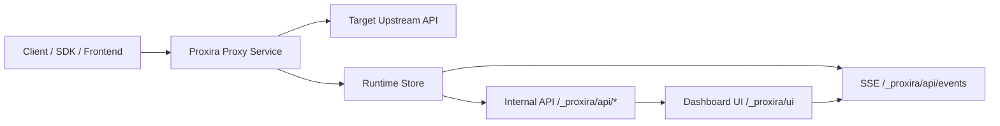

<p align="center">
  
</p>

<h1 align="center">Proxira</h1>

<p align="center">
  轻量化实时请求代理工具：本地转发 + 可视化观测面板
</p>

<p align="center">
  <a href="https://www.npmjs.com/package/proxira"></a>
  
  
  
</p>

Proxira 是一个面向本地开发联调的代理与观测工具。你可以把前端、SDK、脚本请求统一指向本地代理入口，再通过 Web 管理面板实时查看请求/响应、耗时、错误、转发地址配置等信息。

> [!IMPORTANT]
> Proxira 的定位是本地开发调试工具，不建议直接暴露在公网环境。

## 核心能力

- 透明代理转发：保留 Method / Path / Query / Headers / Body。
- 实时观测：SSE 推送请求事件，面板实时更新；支持状态筛选、方法筛选、耗时排序、时间排序。
- 新请求提示：来了新请求，详情不动，底部浮出「N 条新请求」，点一下跳到最新；悬浮层不参与布局，所以来消息时界面不会上下跳。
- 请求详情：概览按「时间 → 请求 → 响应 → 来源」的阅读顺序铺开全部字段，时间给到毫秒。
- 多转发地址管理：每个转发地址独立的上游地址与历史记录。
- 多格式正文查看：JSON / XML / YAML / HTML / CSV / Markdown / Text；JSON 树带行号、可逐层折叠，SSE 响应按帧折叠；正文内查找用浏览器自带的 ⌘F / Ctrl+F。
- Mock 拦截：全局分组管理，一个分组装多条接口规则，命中即返回、不打上游；转发地址按分组勾选生效。
- 故障注入：按转发地址配置，命中后模拟错误、延迟、流式中断、响应截断。
- 请求头分组：固定请求头 + 名称前缀改写规则打包成可复用分组，多个转发地址共用；生效顺序即分组列表顺序，后者覆盖前者。
- 设置面板：顶栏齿轮集中管理——数据存储文件夹（含一键在文件管理器中打开）、主题切换、清空所有数据，以及请求头分组与 Mock 分组的完整编辑。对话框固定高度，切换标签不跳高，内容超出滚动。
- 请求重放与差异对比：改完参数直接重发上游，并与原响应做逐行差异对比。
- 敏感信息脱敏：`authorization` / `cookie` / `api_key` 等默认打码，可一键切换原文。
- 数据导出与复制：历史记录导出 JSON；详情一键复制 URL、Headers、Body、cURL。
- HTTPS 本地调试：一键生成自签名证书并启用 HTTPS。
- 局域网共享：`--host` 开放到局域网，启动横幅直接给出可发给同事的地址。
- 可选访问令牌：`--token` 保护内部 API 与 SSE。
- 统一数据目录：历史与配置存放在用户级目录，与端口 / 启动方式 / 工作目录无关，并提供旧数据迁移命令。

> [!NOTE]
> 默认只监听 `127.0.0.1`，其他电脑连不上；要让局域网访问用 `proxira --host`（不带值即可）。
> 正文默认完整记录，超过 `PROXY_MAX_BODY_CAPTURE_BYTES`（默认 2MB）只截断记录、不截断转发。
> 流式响应（SSE 等）默认全量捕获，且不会因超时被掐断——详见下方「能力边界」。

> [!WARNING]
> **不支持 WebSocket 等 HTTP Upgrade 协议**：握手请求返回 `501` 且不发往上游。
> 需要调试 WebSocket 时请让客户端直连上游。

## 局域网共享：让其他电脑也用这台机器上的代理

默认只监听 `127.0.0.1`，**只有本机自己能连**，同一网络下的其他电脑连不上。要让别的机器也用，
启动时加 `--host`（不带值），它就等同于 `--host lan` / `--host 0.0.0.0`（监听所有网卡）：

```bash
proxira --host          # 最常用：直接开放到局域网
proxira --host lan      # 同上，写清楚一点
proxira --host 192.168.1.4   # 只监听某一张网卡
```

启动后横幅会直接给出这台机器对外的地址，别的电脑填它就行：

```text
Proxy: http://192.168.1.4:3000/proxira      ← 其他电脑填这个
Local: http://localhost:3000/proxira        ← 本机自己用这个
Host: 0.0.0.0
Dashboard: http://192.168.1.4:3000/_proxira/ui
```

| 监听地址 | 谁能连 | 什么时候用 |
|---|---|---|
| `127.0.0.1`（默认） | 只有本机 | 日常开发，最安全 |
| `lan` / `0.0.0.0` | 同一网络下的所有设备 | 多台电脑联调、手机/另一台机器访问面板 |
| `<本机 IP>`（如 `192.168.1.4`） | 只能通过该网卡连进来 | 只想暴露某一条网络（如只对公司内网、不对 VPN） |

> [!WARNING]
> 对局域网开放后，同一网络里的任何人都能看到你的请求历史和响应正文（含 token / cookie），
> 也能通过面板改上游地址。请只在可信网络里开，必要时配合 `--token`。

> [!TIP]
> `--host` 填的是**本机要监听哪个网卡**，不是「上游地址」也不是「别人的地址」，
> 所以通常不用填 `192.168.x.x`——直接 `--host lan` 就行，换网络也不会失效。

## 折叠与窄屏自适应

- **JSON / SSE 折叠**：JSON 对象与数组带折叠三角；SSE 响应按帧展示，点标题行收起/展开单帧，另有「全部折叠 / 全部展开」。
- **窄屏自适应**（≤960px）：标题与转发地址同行；历史请求收进转发地址行的选择器对话框；
  内容区跟随父盒子缩放，被压缩时在容器内部横向滚动。

## 架构概览


```mermaid
flowchart LR
  Client[Client / SDK / Frontend] --> Proxy[Proxira Proxy Service]
  Proxy --> Upstream[Target Upstream API]
  Proxy --> Runtime[Runtime Store]
  Runtime --> SSE[SSE /_proxira/api/events]
  Runtime --> API[Internal API /_proxira/api/*]
  API --> Dashboard[Dashboard UI /_proxira/ui]
  Dashboard --> SSE
```

- `apps/getway`：Node.js 代理服务 + CLI（npm 包主体）。
- `apps/dashboard`：React 19 + Vite + Tailwind v4 管理面板。
- `packages/core`：前后端共享类型定义。

## 仓库结构

```text
proxira/
├─ apps/
│  ├─ getway/       # 代理服务、CLI、内部 API、SSE、打包入口
│  └─ dashboard/    # React 管理面板
├─ packages/
│  └─ core/         # 共享 types
├─ package.json     # Monorepo 根脚本
└─ pnpm-workspace.yaml
```

## 快速开始

### TL;DR

```bash
npx proxira                 # 直接用（无需安装）
pnpm dev                    # 本地开发：一行启动后端 + 面板
pnpm start                  # 构建并启动（等价于跑发布产物）
pnpm run release            # 发版并发布到 npm（注意要带 run）
```

### npm 仓库说明

- npm 包名：`proxira`
- npm 地址：`https://www.npmjs.com/package/proxira`
- 可执行命令：`proxira`
- 发布来源：`apps/getway`（仓库根目录是 monorepo 管理脚本，`private: true`，不会发布到 npm）

推荐使用方式：

```bash
# 临时使用最新版（推荐）
npx proxira@latest

# 固定版本使用（便于团队复现）
npx proxira@0.4.0

# 全局安装
npm i -g proxira
```

包内主要包含：

- `dist/`：CLI 与代理服务可执行代码
- `dashboard-dist/`：管理面板静态资源
- `README.md`：npm 展示文档

### 方式一：直接使用 npx（推荐）

```bash
npx proxira
```

默认访问地址：

- 代理入口：`http://localhost:3000/proxira`
- 管理面板：`http://localhost:3000/_proxira/ui`
- 健康检查：`http://localhost:3000/_proxira/api/health`

### 方式二：本地仓库开发

```bash
# 1) 安装依赖
pnpm install

# 2) 一键启动（后端代理 :3000 + 面板 dev server :5173，并行热更新）
pnpm dev

# 或只想跑构建产物：构建 + 启动（只有 :3000）
pnpm start
```

- 后端代理：`http://127.0.0.1:3000`
- 面板热更新：`http://127.0.0.1:5173`（已配置代理，可直接调 `/_proxira/api/*`）
- 完整命令见 [开发命令](#开发命令monorepo)。

## 常见使用方式

### 指定端口和上游

```bash
npx proxira --port 3010 --target http://localhost:8080
```

### 自定义代理前缀

```bash
npx proxira --prefix /debug-proxy --target http://localhost:8080
```

### 关闭前缀（直转发）

```bash
npx proxira --no-prefix --target http://localhost:8080
```

> [!TIP]
> 关闭前缀后，`/_proxira/*` 仍保留给管理面板与内部 API，其余路径会转发到上游。

### 转发地址级超时

在面板「编辑当前转发地址」里可以单独设置上游超时（毫秒），留空则回落到全局的
`PROXY_UPSTREAM_TIMEOUT_MS`（默认 30s）。适合某个上游特别慢、又不想把全局超时调大的场景，
超时后该转发地址的请求返回 504。

## HTTPS 调试模式

```bash
# 1) 生成本地证书（带环境检测）
npx proxira gen-cert

# 2) 启动 HTTPS
npx proxira --https
```

手动指定证书（默认位于 `<数据目录>/certs/`）：

```bash
npx proxira --https --https-key ./my-certs/key.pem --https-cert ./my-certs/cert.pem
```

## CLI 命令

```bash
proxira [options]
proxira clear-cache [options]
proxira gen-cert [options]
```

常用参数：

| 参数 | 说明 | 默认值 |
| --- | --- | --- |
| `-p, --port <port>` | 服务端口 | `3000` |
| `-t, --target <url>` | 上游服务地址 | `http://localhost:8080` |
| `-d, --data-dir <path>` | 数据目录 | `./.proxira` |
| `--host [address]` | 监听地址；不带值 = `lan` = `0.0.0.0` = 局域网可访问 | `127.0.0.1` |
| `-x, --prefix <path>` | 自定义代理前缀 | `/proxira` |
| `-nx, --no-prefix` | 关闭代理前缀 | - |
| `-s, --https` | 启用 HTTPS | - |
| `--https-key <path>` | HTTPS 私钥路径 | - |
| `--https-cert <path>` | HTTPS 证书路径 | - |
| `-b, --no-banner` | 关闭启动 Banner | - |
| `--token <token>` | 为内部 API / SSE 设置访问令牌 | 关闭 |
| `-h, --help` | 帮助信息 | - |
| `-v, --version` | 版本信息 | - |

`gen-cert` 参数：

| 参数 | 说明 | 默认值 |
| --- | --- | --- |
| `-o, --output-dir <path>` | 证书输出目录 | `<数据目录>/certs` |
| `-c, --common-name <name>` | 证书通用名 | `localhost` |
| `--days <number>` | 证书有效期（天） | `365` |
| `-y, --yes` | 跳过确认直接生成 | - |

## 数据目录

数据目录与启动端口、启动方式、工作目录**无关**，统一按以下优先级解析：

1. `--data-dir <path>` 参数（相对路径相对当前目录解析）
2. `PROXY_DATA_DIR` 环境变量
3. 用户级默认目录：macOS `~/Library/Application Support/Proxira`，Linux `$XDG_DATA_HOME/Proxira`（默认 `~/.local/share/Proxira`），Windows `%APPDATA%\Proxira`

目录内存放 `config.json`（转发地址、请求头分组、Mock 分组）、`history.json`（请求历史）、`rules.json`（故障注入规则）、`instance.json`（运行实例锁）与 `certs/`（证书）。启动 Banner 会显示当前数据目录及其来源。

```bash
proxira data-dir                        # 查看当前数据目录及来源
proxira migrate-data                    # 把旧版工作目录下的 ./.proxira 迁移到统一目录
proxira migrate-data --from /some/.proxira  # 指定旧目录迁移
```

> 旧版本默认把数据写在启动目录下的 `./.proxira/`。升级后启动时若检测到旧目录里有历史数据会给出提示，按上面命令迁移即可，历史不会丢。

## 开发命令（Monorepo）

所有命令都在**仓库根目录**执行。

| 命令 | 作用 |
| --- | --- |
| `pnpm dev` | 一键启动：后端 watch（`tsx watch`，:3000）+ 面板 dev server（:5173），并行运行 |
| `pnpm dev:server` | 只起后端（:3000） |
| `pnpm dev:web` | 只起面板（:5173） |
| `pnpm build` | 构建可发布产物：先 build dashboard → 同步到 `apps/getway/dashboard-dist` → 再 `tsc` 后端 |
| `pnpm start` | `build` + 启动后端（等价于跑发布包） |
| `pnpm serve` | 只启动后端（用已有 `dist`，不重新构建） |
| `pnpm test` | 后端 vitest 全量测试 |
| `pnpm run pack:app` | 构建并生成 npm tarball 到仓库根目录（本地验证发布产物） |
| `pnpm run release` | patch 版本号 + 发布到 npm |
| `pnpm run release:minor` / `release:major` | minor / major 版本号 + 发布 |

> [!TIP]
> **dev 模式请用环境变量调参，CLI 参数无效**：`pnpm dev` 跑的是 `src/index.ts`（不是 `cli.ts`），
> 而 `-p` / `-t` / `--host` 等参数只在 `cli.ts` 里解析（`cli.ts` 的工作就是把参数转成环境变量再启动服务）。
> 想改端口／上游就写环境变量：
>
> ```bash
> PORT=4000 pnpm dev
> PORT=4000 PROXY_TARGET_URL=http://127.0.0.1:8080 pnpm dev:server
> ```
>
> 完整对照见下方「环境变量」表。

> [!WARNING]
> 不要直接敲 `pnpm pack` / `pnpm publish` —— 这两个是 **pnpm 内置命令**，作用于根目录自身（本仓库根包名为
> `proxira-monorepo` 且 `private: true`），不会带上 `run`。发布一律走上面的 `pnpm run pack:app` / `pnpm run release`。

### 发布到 npm

```bash
# 1) 本地验证产物（生成 proxira-<version>.tgz，可装到干净目录试跑）
pnpm run pack:app

# 2) 登录一次即可
npm login

# 3) 发版并发布（会自动触发 prepublishOnly → build:pkg）
pnpm run release          # patch
pnpm run release:minor    # minor
```

> [!TIP]
> 发布走的是 `pnpm publish`（**不是** `npm publish`）。原因：`@proxira/core` 用的是 `workspace:*` 协议，
> 只有 pnpm 会把它改写成真实版本号；用 npm 打包会把 `workspace:*` 原样写进 manifest，用户安装时会解析失败。
>
> `prepublishOnly` 已挂了 `build:pkg`，所以不会出现「忘了构建就发出去、面板是旧版」的情况。

### 发布前自查

```bash
pnpm test                 # 后端测试
pnpm build                # 全量构建
pnpm run pack:app         # 看 tarball：只应有 dist / dashboard-dist / README.md / package.json
tar -tzf proxira-*.tgz | grep -v -E '^package/(dist|dashboard-dist)/'
```

## 环境变量

| 变量 | 说明 | 默认值 |
| --- | --- | --- |
| `PORT` | 服务端口 | `3000` |
| `PROXY_TARGET_URL` | 默认上游地址 | `http://localhost:8080` |
| `PROXY_DATA_DIR` | 本地数据目录 | `./.proxira` |
| `PROXY_PREFIX` | 代理前缀 | `/proxira` |
| `PROXY_PREFIX_ENABLED` | 是否启用代理前缀 | 启用 |
| `PROXY_HOST` | 监听地址 | `127.0.0.1` |
| `PROXY_UPSTREAM_TIMEOUT_MS` | 上游请求超时（毫秒），超时返回 504 | `30000` |
| `PROXY_MAX_BODY_CAPTURE_BYTES` | 单条**非流式**正文记录上限，超出只记录前缀并标记 truncated | `2097152` |
| `PROXY_STREAM_MAX_CAPTURE_BYTES` | 流式响应（SSE / multipart）捕获字节上限，`0` = 不限制 | `0` |
| `PROXY_STREAM_MAX_CAPTURE_MS` | 流式响应采样时长上限（毫秒），`0` = 不限制 | `0` |
| `PROXY_PERSIST_DEBOUNCE_MS` | 落盘防抖间隔（毫秒） | `500` |
| `PROXY_HISTORY_LIMIT` | 内存历史上限 | `1000` |
| `PROXY_HISTORY_PERSIST_LIMIT` | 落盘历史上限 | `200` |
| `PROXY_HISTORY_PERSIST_BODY_LIMIT` | 落盘时单条正文重新裁剪上限（内存仍保留完整内容） | `65536` |
| `PROXY_ACCESS_TOKEN` | 内部 API / SSE 的访问令牌，未设置则不做校验 | - |
| `PROXY_QUERY_LIMIT_MAX` | 查询接口最大 limit | `500` |
| `PROXY_SSE_HEARTBEAT_MS` | SSE 心跳间隔（毫秒） | `15000` |
| `PROXY_DISABLE_BANNER` | 是否关闭启动 Banner | 关闭为 `1` |
| `PROXY_HTTPS_ENABLED` | 是否启用 HTTPS | 关闭 |
| `PROXY_HTTPS_KEY_PATH` | HTTPS 私钥路径 | - |
| `PROXY_HTTPS_CERT_PATH` | HTTPS 证书路径 | - |

## 请求详情面板

选中一条请求后默认落在「概览」。概览不做卡片分块，而是按人类读一条请求的顺序**从上到下铺开**：

```
时间   06:13:47.574  /  2026-09-21  星期日  /  3 分钟前
请求   [POST] https://api.example.com/v1/chat/completions   [复制]
       Query / 请求大小 / 请求头 / 请求正文
响应   500  Internal Server Error      3 ms
       （相对耗时条：本条 vs 当前列表最慢）
       响应大小 / 响应头 / 响应类型 / 响应正文
来源   产生方式 / 命中规则 / 记录 ID
```

几个刻意的选择：

- **时间放在第一位，且精确到毫秒。** 同一次页面加载、同一个 SDK 的重试会在同一秒内发出好几条请求，列表里的秒级时间分不出先后，概览里的毫秒可以。完整 ISO 时间戳挂在悬浮提示里。
- **不做卡片。** 卡片边框 + 内边距会把一屏能看完的字段切成好几块，眼睛要在盒子之间来回跳；改成标签列定宽 + 值列左对齐的定义列表，才能顺着往下扫。
- **相对时间自己走针**（15 秒一次）。没有新请求时 SSE 不会推事件，页面不会重渲染，不走针的话「3 分钟前」会永远停在三分钟前。
- 相对耗时条以**当前列表里最慢的一条**为基准，给「这条有多慢」一个视觉锚点。

### 新请求提示

来了新请求时，屏幕底部会浮出一条「N 条新请求 · GET /path · 200 · 32ms · 查看最新」的胶囊：

- **详情不会自动跳转。** 新请求只以这条胶囊的形式出现，点它才跳过去。你要读的那条请求不会被抢走焦点 —— 正看着一条请求被硬切走是最烦人的行为。
- **点数就是「你比最新落后了几条」**：选中项在列表里的位置（列表按时间倒序）。没选中任何一条时不提示。
- 点胶囊跳到最新一条，提示随即消失；右侧 `✕` 只忽略提示、不跳转，更新的请求进来时会重新出现。
- 一次页面加载连发 20 条也只会是**一条**胶囊（计数从 1 涨到 20），不会被弹一脸。
- **底部居中悬浮，完全不参与布局。** 早先版本是顶栏下方独占一行（`grid-rows 0fr→1fr` 撑开），提示出现/消失会把整页内容上下推 57px，正读着的内容跟着跳；现在改成 `position: fixed` 浮在底部，出现前后页面高度不变。
- 放**底部**而不是顶部是刻意的：顶栏、转发地址行、详情头部全挤在上方，浮层压过去必盖住可交互控件；底部通常只有正文的空白区。窄屏只保留「N 条新请求 + 查看最新」，路径与耗时让位。
- 外层容器 `pointer-events-none`、只有胶囊本身可点，透明区域不会吃掉下方内容的点击。出现时用 220ms 上浮淡入。

> 计数刻意不做「累加计数器」，而是从 `records` + 选中项**派生**：
> 列表倒序时「选中项的下标」就是落后条数。这样切换转发地址、清除记录、流式响应补全
> 都不需要特殊处理，也不可能出现「漏加一条」或「某处忘了清零」。

## 管理接口（概览）

| 方法 | 路径 | 说明 |
| --- | --- | --- |
| `GET` | `/_proxira/api/health` | 健康检查 |
| `GET` | `/_proxira/api/status` | 服务状态（含 `dataDir` 数据目录） |
| `GET` | `/_proxira/api/config` | 读取当前配置 |
| `PUT` | `/_proxira/api/config` | 切换激活转发地址 |
| `POST` | `/_proxira/api/groups` | 创建转发地址（可带 `headerPresetIds` / `mockGroupIds`） |
| `PUT` | `/_proxira/api/groups/:id` | 更新转发地址（含生效的请求头分组 / Mock 分组） |
| `DELETE` | `/_proxira/api/groups/:id` | 删除转发地址 |
| `GET` | `/_proxira/api/header-presets` | 查询全部请求头分组 |
| `POST` | `/_proxira/api/header-presets` | 创建请求头分组 |
| `PUT` | `/_proxira/api/header-presets/:id` | 更新请求头分组（固定头 / 匹配规则 / 名称） |
| `DELETE` | `/_proxira/api/header-presets/:id` | 删除请求头分组（同时解除各转发地址的引用） |
| `POST` | `/_proxira/api/header-presets/:id/move` | 调整分组顺序（`direction: up｜down`） |
| `GET` | `/_proxira/api/mock-groups` | 查询全部 Mock 分组 |
| `POST` | `/_proxira/api/mock-groups` | 创建 Mock 分组 |
| `PUT` | `/_proxira/api/mock-groups/:id` | 更新 Mock 分组（名称 / 整组开关 / 规则整表替换） |
| `DELETE` | `/_proxira/api/mock-groups/:id` | 删除 Mock 分组（同时解除各转发地址的引用） |
| `POST` | `/_proxira/api/mock-groups/:id/move` | 调整分组顺序（`direction: up｜down`） |
| `GET` | `/_proxira/api/records` | 查询历史 |
| `GET` | `/_proxira/api/records/export` | 导出记录 |
| `DELETE` | `/_proxira/api/records/:id` | 删除单条 |
| `DELETE` | `/_proxira/api/records` | 清空转发地址历史 |
| `GET` | `/_proxira/api/rules` | 查询当前转发地址的拦截规则 |
| `POST` | `/_proxira/api/rules` | 创建拦截规则 |
| `PUT` | `/_proxira/api/rules/:id` | 更新拦截规则（含启用/停用） |
| `DELETE` | `/_proxira/api/rules/:id` | 删除拦截规则 |
| `POST` | `/_proxira/api/replay` | 重放一次请求（不经过规则引擎；`useCustomHeaders: true` 才套用请求头分组） |
| `GET` | `/_proxira/api/events` | SSE 事件流 |
| `POST` | `/_proxira/api/reset` | 重置数据 |
| `POST` | `/_proxira/api/open-folder` | 在系统文件管理器中打开数据目录 |

## Mock 拦截（分组 / 接口规则）

Mock 是**全局分组**模型：分组在设置面板的「Mock 拦截」里维护，一个分组装多条接口规则，转发地址在「编辑当前转发地址」里勾选要让哪些分组生效。同一个分组可以给多个地址复用。

一条规则 = 匹配（路径片段 + 可选 Method）+ 响应（状态码 / Headers / 正文，可勾选以 SSE 分片下发）。**命中的请求直接返回，不会打到上游**。

匹配顺序：按分组列表顺序逐个分组问，组内第一条命中的规则胜出；分组可以整组停用，也可以单独停用某条规则。分组没有任何可交互的「顺序」之外的隐藏状态——顺序就是在设置里看到的列表顺序（上移 / 下移调整）。

## 故障注入（延迟 / 错误 / 断流 / 截断）

和 Mock 的分界线是：Mock **替上游回答**，故障注入**让上游出错**（请求仍会打到上游，只是在回程上做手脚）。

| 动作 | 作用 | 典型场景 |
| --- | --- | --- |
| `error` | 直接以指定状态码失败，不请求上游 | 复现 5xx / 网关错误 |
| `delay` | 先等待 N 毫秒，再正常转发 | 复现慢请求、验证前端 loading |
| `break_stream` | 流式响应在第 N 个分片后断开 | 复现 SSE/LLM 流式中断 |
| `truncate` | 只保留响应前 N 字节后断开 | 复现响应被截断、JSON 解析失败 |

故障注入规则仍挂在**转发地址**上（每个地址一套），入口在设置面板的「Mock 拦截」标签底部。命中的记录会在列表里带「规则」标记，详情里也能看到命中的规则 id。

## 请求头分组（固定头 / 改写规则）

和 Mock 一样是**全局分组**模型：设置面板的「请求头」里定义分组，转发地址里勾选生效，同一套鉴权头可以给多个地址共用。勾选多个分组时按**分组列表顺序**依次叠加，**后面的覆盖前面的**（列表里的上移/下移就是调整这个顺序）。

**固定请求头**：每个出站请求都会带上，同名时覆盖客户端原值，可以加多条（例如给上游换一套鉴权头、或补一个必须存在的租户标识）。

**匹配规则**：按请求头**名称前缀**匹配（大小写不敏感），命中多个头时一起处理：

| 动作 | 作用 | 典型场景 |
| --- | --- | --- |
| `set` | 把命中的请求头改写为新值 | 换掉客户端带来的旧 token、固定 `x-tenant-id` |
| `ignore` | 命中的请求头直接不转发 | 去掉 `x-internal-*` 这类不该外泄的内部头 |

执行顺序固定，也是唯一的顺序约定：

```
客户端头 → 剥离代理接管的头
        → 逐个分组（按列表顺序）执行：写入固定请求头 → 依次执行匹配规则
        → 再剥离一次受保护头
```

- **分组之间**：后面的分组覆盖前面的（同一个头两个分组都写了，靠后的赢）。
- **分组内部**：规则在固定请求头之后执行，所以规则命中的范围包含本组的固定头（`x-` 前缀能一次改写或删掉多个头，包括固定头）。
- 多条规则按顺序执行，**后面的覆盖前面的**（同名前缀时最后一条生效）。
- 规则可单独启停，停用后立刻恢复原样。
- **被代理接管的头不可配置**：`host`、`content-length`、`transfer-encoding`、`connection`、`accept-encoding` 等既不能设为固定头，也不会被规则复活——它们要么会让请求非法，要么会让上游返回压缩体导致面板看到二进制。配置里写了会在保存时返回 `400` 并给出具体原因。
- 请求头名称必须符合 HTTP 规范；值里不允许出现换行（避免把配置变成请求头注入）。
- 面板里记录的仍是**客户端原始请求头**，改写只影响发往上游的内容，不会反过来改写历史记录。
- 重放默认**不带**这套配置（重放的意义是复现原始请求），需要时在重放对话框勾选「启用自定义请求头」。
- 旧版本按转发地址存的请求头配置会在首次启动时自动迁移成一个名为「<地址名> 的请求头」的分组并勾选上，之后统一在分组里编辑；同理，旧的 `mock` 类型拦截规则会迁移成名为「<地址名> 的 Mock」的分组。

## 请求重放与差异对比

选中任意记录后点「重放请求」：

1. 表单已按原请求预填 METHOD / URL / HEADERS / BODY，可以直接改（比如换个 model、改个 temperature）。
2. 发送后展示新响应的状态码、耗时，以及与**原响应**的逐行差异（`+新增 / -减少` 行数）。
3. 重放**不经过拦截规则与 Mock 分组**，看到的永远是上游真实行为；请求头分组也默认不套用，需要时勾选「启用自定义请求头」。
4. 重放结果会写入历史并标记「重放」，方便和原始请求对照。

## 敏感信息脱敏

默认对展示层做打码，不改落盘数据：

- 请求/响应 Headers：`authorization`、`cookie`、`set-cookie`、`x-api-key`、`token`、`secret`、`password`、`session-id` 等键的值。
- JSON 正文：递归匹配上述键名的值（含嵌套对象）。
- 文本正文：`"key|token|secret|password|authorization": "..."` 与 `Authorization: Bearer ...` 形式的片段。
- 「复制 cURL」同样遵循当前脱敏状态。

点工具栏的眼睛图标可在「脱敏 / 原文」之间切换。

## 访问令牌（可选）

```bash
npx proxira --token my-secret
```

启用后：

- `/_proxira/api/*`（含 SSE 事件流）必须携带令牌，否则返回 401。
- 传参方式二选一：`Authorization: Bearer my-secret`，或 URL 查询参数 `?token=my-secret`。
- 面板打开时带上 `?token=my-secret` 一次即可，令牌会存在 `sessionStorage`，后续请求自动携带。
- 面板的 HTML 与 JS/CSS 静态资源**不校验令牌**（浏览器无法给 `<script>`/`<link>` 请求加头），但拿不到令牌时接口全 401，页面只会是空的。

## 测试

```bash
# getway 单元/集成测试
pnpm test

# dashboard 类型检查 + 构建校验
pnpm --filter @proxira/dashboard build
```

> [!WARNING]
> 默认会记录请求与响应正文，请在真实数据联调时注意敏感信息处理。

## 能力边界

- **不支持 WebSocket 及其他 HTTP Upgrade 协议**：转发链路基于 `fetch()`，无法完成协议切换。
  握手请求会被显式拒绝（返回 `501`、不转发、面板记录写明原因），不会静默降级成普通请求。
  调试 WebSocket 请让客户端直连上游。
- **不做系统代理接管**：Proxira 只监听自己的端口，需要你在客户端里把请求地址指过去，
  不会改写系统网络设置。
- **不解密 HTTPS 上游**：转发会把请求原样发给上游；只有 `--https` 是让**客户端到代理**这一段走 HTTPS（自签名证书）。
- **定位是本地开发调试工具**，请勿直接暴露公网：面板能查看完整请求/响应正文，也能改上游地址。
  对局域网开放（`--host`）时请只在可信网络里用，必要时配合 `--token`。
- **正文记录有上限**：单个正文超过 `PROXY_MAX_BODY_CAPTURE_BYTES`（默认 2MB）时，
  记录会截断为前缀并标记 `truncated`；转发给客户端的响应始终完整。
- **流式响应默认全量捕获**：不按长度截断，也不会因为跑过 `PROXY_UPSTREAM_TIMEOUT_MS` 被掐断——
  该超时只约束「等待上游响应头」这一段，响应头到达后即解除。
  要重新加上限用 `PROXY_STREAM_MAX_CAPTURE_BYTES` / `PROXY_STREAM_MAX_CAPTURE_MS`。
- **落盘与内存不等量**：内存中是完整正文，落盘时按 `PROXY_HISTORY_PERSIST_BODY_LIMIT`（默认 64KB）
  裁剪以控制 `history.json` 体积。
